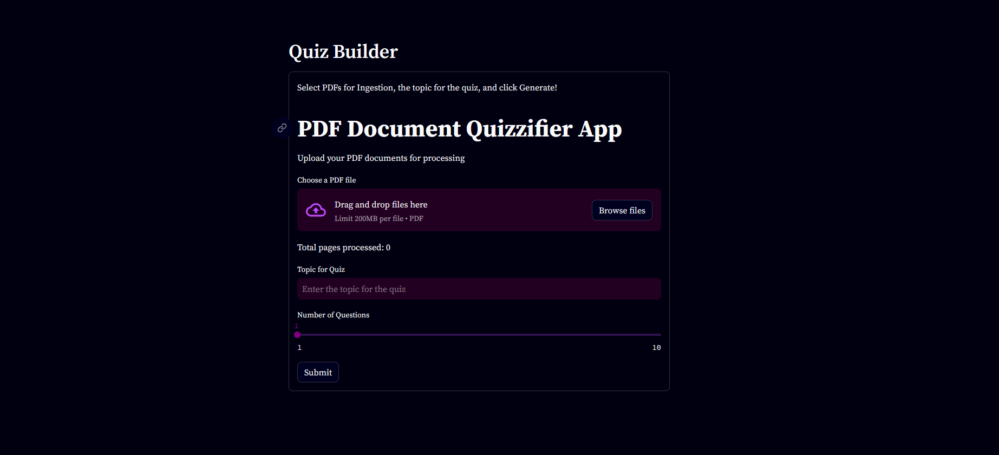

# Quiz Builder

A simple quiz builder application where you can upload PDFs on topics. The app will generate a set of multiple  choice questions (MCQs).  
You can take the quiz and see if you can answer all of them correctly. Each answer will also have an explanation for the correct answer.

## How to use

- Clone the repository into your local machine
- Open a google cloud account and install gcloud cli (Authenticate using gcloud cli)
- Install necessary packages using `pip install -r requirements.txt`
- Run application using `streamlit run app/main.py`

### Under the hood 
It uses Google Gemini as the LLM and uses a chromadb vector database for the knowledge base embedding.

